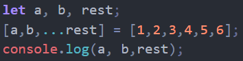
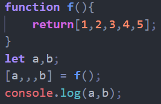
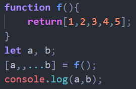
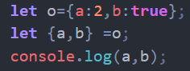

# 1.let.const命令

## 作用域

- 全局作用域
- 函数作用域
- 块作用域
  - 一个{ }里为一个块作用域

## let和const用法

- let
  - 和var的作用相似，作用域为块作用域，不能重复定义
- const
  - 用来声明常量，声明时必须赋值，且不能修改，但声明为对象时可修改

# 2.解构赋值

就是一种特殊的赋值方法

## 数组解构赋值

 **= 的两边写数组**

- ...rest表示之后的数字形成一个数组，表示[3,4,5,6]

- ,,之间表示一个元素，跟在后面的元素要相应推后

- 前面两种还能结合来使用

## 对象解构赋值

 **= 的两边写对象**

