# 一、新增的主体结构元素

## 1.article元素

**解释：**

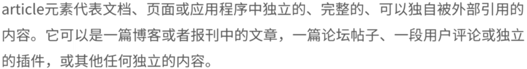

**用法：**

```html
<article>
	...
</article>
```

- 可以嵌套使用
- 可以用来表示插件

## 2.section元素

**解释：**

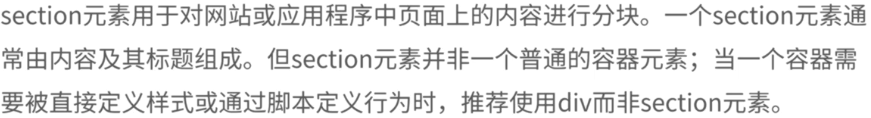

**用法：**

```html
<section>
	...
</section>
```

- 将页面上的内容进行分块
  - 需要有标题和内容
- 不要作为设置样式的页面容器、
- 和article可以互相嵌套

## 3.nav元素

**解释：**


**用法：**

```html
<nav>
	...
</nav>
```

- 应用场景
  - 传统导航栏
  - 侧边栏导航
  - 页内导航
  - 翻页操作

## 4.aside元素

**解释：**

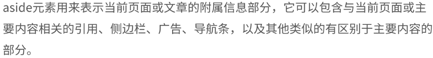

用法：

```html
<aside>
	...
</aside>
```

## 5.time元素和pubdate属性

**time元素解释：**

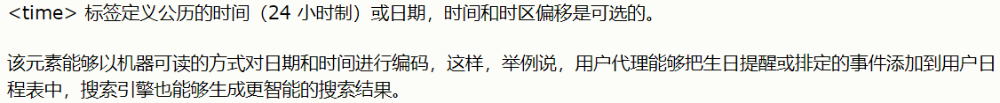

**pubdate属性解释：**

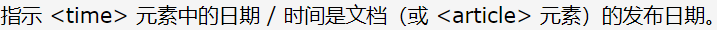

# 二、新增的非主体结构元素

## 1.header元素

**解释：**

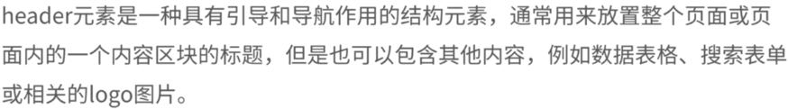

**用法：**

```html
<header>
	<h1>...</h1>
    <a href="#">...</a>
    <nav>
    	<ul>
            <li><a href="#">...</a></li>
            <li><a href="#">...</a></li>
            <li><a href="#">...</a></li>
        </ul>
    </nav>
</header>
```

## 2.footer元素和hgroup元素

**footer元素解释：**

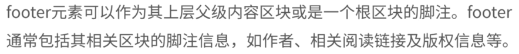

**hgroup元素解释：**

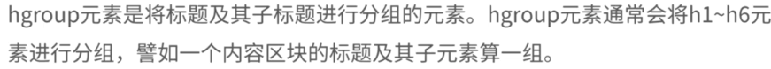

将标题和多个子标题放在hgroup元素中

```html
<hgroup>
	<h1>...</h1>
    <h2>...</h2>
</hgroup>
```

## 3.address元素

**解释：** 

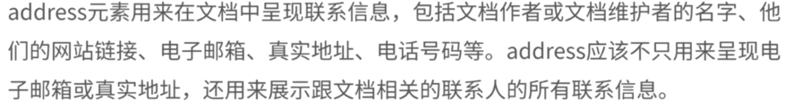

# 三、表单新增元素与属性

## 1.form属性和formaction属性

**form属性解释：**

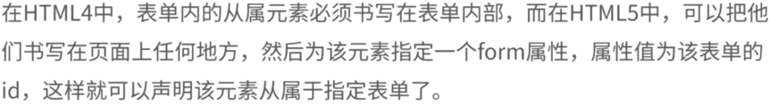

**formaction属性解释：**

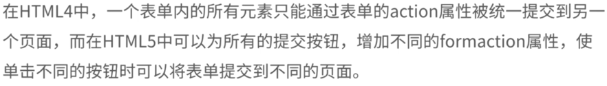

## 2.formmethod和formenctype属性

**formmethod属性解释：**

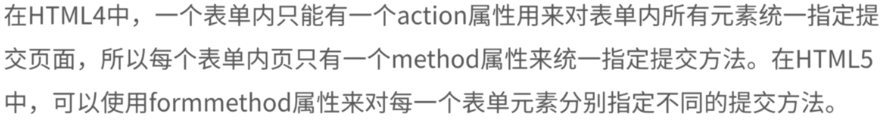

**formenctype属性解释：**

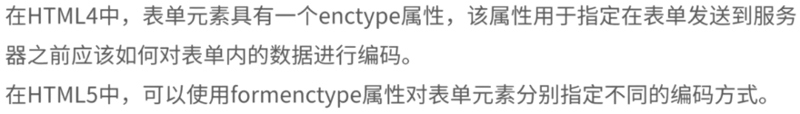

## 3.formtarget和autofoces属性

**formtarget属性解释：**


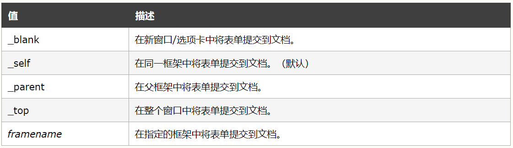

**autoforces属性解释：**

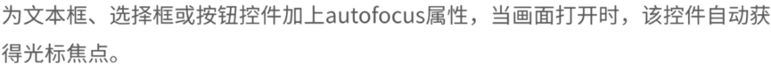

## 4.required和lables属性

**required属性解释：**

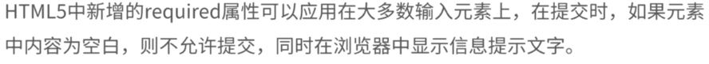

**lables属性解释：**

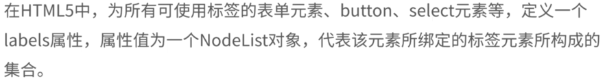

## 5.control和placeholder属性

**control属性解释：**

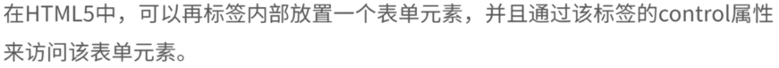

**placeholder属性：**

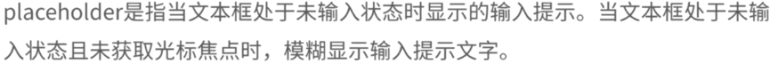

## 6.list和AutoComplete属性

**list属性解释：**

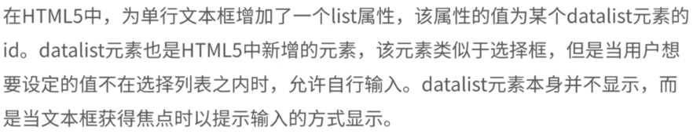

**AutoComplete属性解释：**

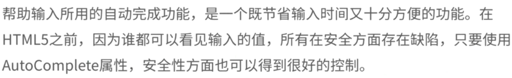

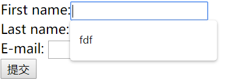

## 7.pattern和SelectionDirection属性

**pattern属性解释：**

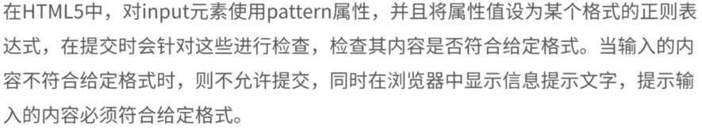

**SelectionDirection属性解释：**

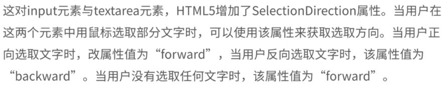

## 8.indeterminate属性

**indeterminate属性解释：**

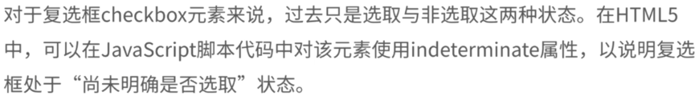

# 四、改良的input元素的种类

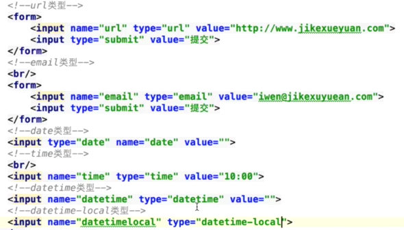

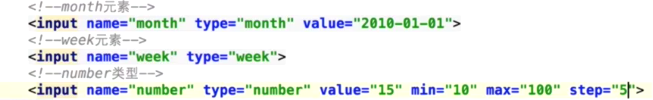

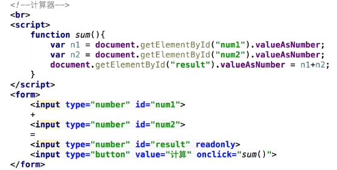

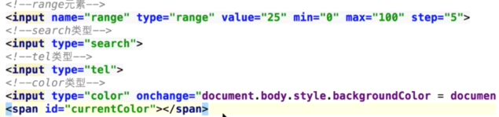

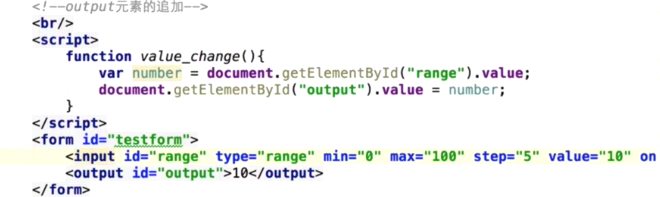

**表单验证**

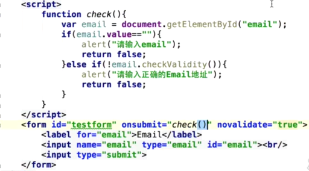

# 五、增强的页面元素

## 1.figure、figcaption、details、summary 和 mark 元素

**figure元素解释：**


**figcaption元素解释：**

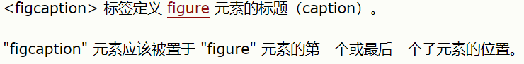

**details元素解释：**

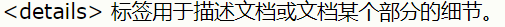

效果：

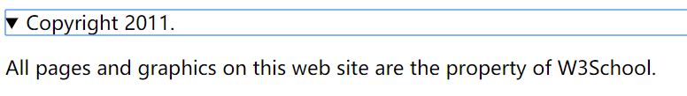

**summary元素解释：**

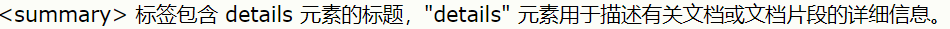

**mark元素解释：**

<mark>元素用于在文字中高亮。

## 2.progress 和 meter 元素

**progress元素解释：**

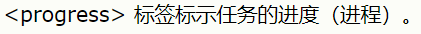

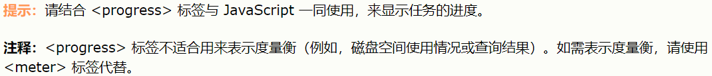

**meter元素解释：**

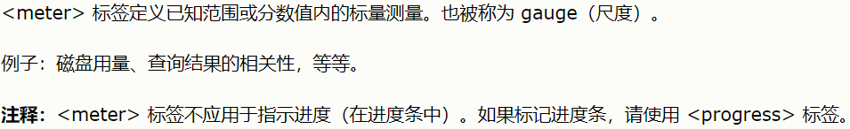

## 3.ol、dl、cite和small元素

**ol元素解释：**

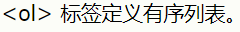


**dl元素解释：**

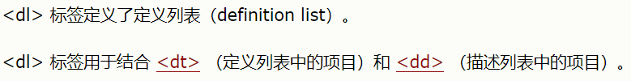

**cite元素解释：**

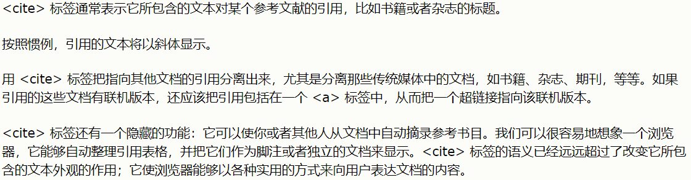

**small元素解释：**

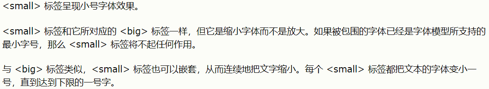

# 六、音频视频

## 1.音频播放

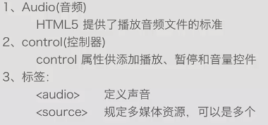

如果不想用浏览器的音频播放器，可以用自己的javascript代码代替control

## 2.视频播放

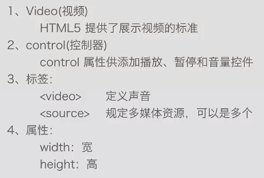

# 七、拖放

## 1.拖放

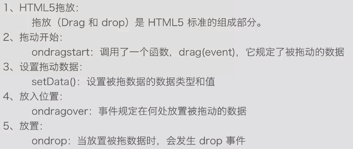

## 2.拖放本地资源

见代码

# 八、canvas标签的使用

## 1.创建canvas标签

- 通过HTML创建
- 通过javascript创建
  - document.body.innerHTML

## 2.绘制图

通过API中提供的方法来绘制

```javascript
var canvas = document.getElementById('canvas');
var context = canvas.getContext('2d');
```

## 3.绘制圆

- 开始创建路径

```javascript
context.beginPath();
```

- 创建图形的路径

```javascript
context.arc(...);
```

- 关闭路径

```javascript
context.closePath();
context.fill();
```

- 设定绘制的样式，调用绘制的方法

## 4.绘制渐变图形

- 创建一个沿参数坐标指定的直线的渐变

```javascript
var gradient = context.createLinearGradient(x0, y0, x1, y1);
```

- 添加一个由偏移值和颜色值指定的断点到渐变

```javascript
gradient.addColorStop(offset,color);
```

## 5.绘制变形图形

- 平移

```javascript
context.translate(x,y)//x为原点移动的大小
```

- 缩放

```javascript
context.scale(x,y)//x为x的缩放倍数
```

- 旋转

```javascript
context.rotate(deg)//deg为旋转的角度
```

## 6.图形组合

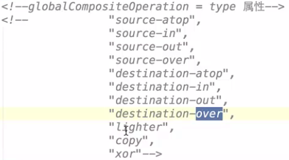

## 7.绘制图形阴影

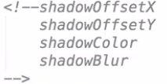

## 8.使用图像

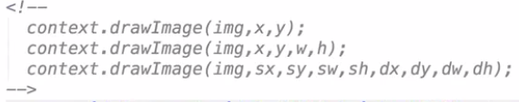

## 9.canvas应用

见代码

# 九、SVG

**SVG介绍：**


引入外部SVG文件，使用`iframe`标签

# 十、响应式布局

## 1.响应式布局介绍

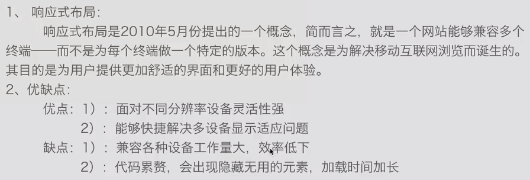

## 2.响应式布局实例

利用css3中的Media Query

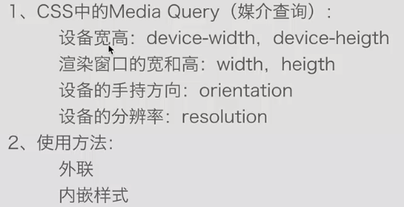

# 十一、==Bootstrap使用==

`getbootstrap.com`


