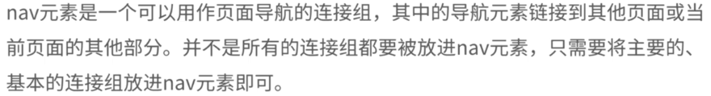

# 一、新增的主体结构元素

## 1.article元素

**解释：**


**用法：**

```html
<article>
	...
</article>
```

- 可以嵌套使用
- 可以用来表示插件

## 2.section元素

**解释：**


**用法：**

```html
<section>
	...
</section>
```

- 将页面上的内容进行分块
  - 需要有标题和内容
- 不要作为设置样式的页面容器、
- 和article可以互相嵌套

## 3.nav元素

**解释：**



**用法：**

```html
<nav>
	...
</nav>
```

- 应用场景
  - 传统导航栏
  - 侧边栏导航
  - 页内导航
  - 翻页操作

## 4.aside元素

**解释：**


用法：

```html
<aside>
	...
</aside>
```

## 5.time元素和pubdate属性

**time元素解释：**


**pubdate属性解释：**


# 二、新增的非主体结构元素

## 1.header元素

**解释：**


**用法：**

```html
<header>
	<h1>...</h1>
    <a href="#">...</a>
    <nav>
    	<ul>
            <li><a href="#">...</a></li>
            <li><a href="#">...</a></li>
            <li><a href="#">...</a></li>
        </ul>
    </nav>
</header>
```

## 2.footer元素和hgroup元素

**footer元素解释：**


**hgroup元素解释：**


将标题和多个子标题放在hgroup元素中

```html
<hgroup>
	<h1>...</h1>
    <h2>...</h2>
</hgroup>
```

## 3.address元素

**解释：** 


# 三、表单新增元素与属性

## 1.form属性和formaction属性

**form属性解释：**


**formaction属性解释：**


## 2.formmethod和formenctype属性

**formmethod属性解释：**


**formenctype属性解释：**


## 3.formtarget和autofoces属性

**formtarget属性解释：**


**autoforces属性解释：**


## 4.required和lables属性

**required属性解释：**


**lables属性解释：**


## 5.control和placeholder属性

**control属性解释：**


**placeholder属性：**


## 6.list和AutoComplete属性

**list属性解释：**


**AutoComplete属性解释：**


## 7.pattern和SelectionDirection属性

**pattern属性解释：**


**SelectionDirection属性解释：**


## 8.indeterminate属性

**indeterminate属性解释：**


# 四、改良的input元素的种类


**表单验证**


# 五、增强的页面元素

## 1.figure、figcaption、details、summary 和 mark 元素

**figure元素解释：**


**figcaption元素解释：**


**details元素解释：**


效果：


**summary元素解释：**


**mark元素解释：**

<mark>元素用于在文字中高亮。

## 2.progress 和 meter 元素

**progress元素解释：**


**meter元素解释：**


## 3.ol、dl、cite和small元素

**ol元素解释：**


**dl元素解释：**


**cite元素解释：**


**small元素解释：**


